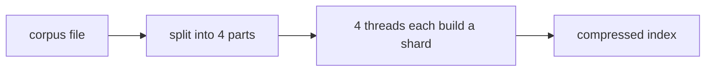
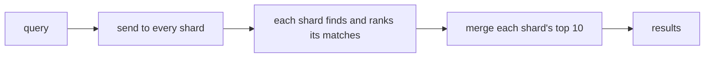

# Recall

A search engine I wrote from scratch in Rust, with no search libraries. It indexes
100K documents, ranks results with BM25, compresses the index, and splits it into
shards that are built and searched in parallel.

I measured every change before and after. The numbers, and the things that didn't
work, are in [BENCHMARKS.md](BENCHMARKS.md).

## How it works

Building the index:



Answering a query:



## Results

100K generated documents (9.9M postings), Apple M2.

| Change | Result |
|--------|--------|
| Merge or galloping search, picked per step | queries mixing common and rare words 6.9x faster |
| Faster tokenizer, fewer allocations, FxHash | indexing 3.1x faster |
| BM25 with a top-k heap | top 10 found 13x faster than sorting every match |
| Delta + varint compression | peak memory 127 MB to 53 MB (queries 1.4-3x slower) |
| 4 shards, built and searched in parallel | indexing 2.5x faster, heavy queries 3x faster (light queries a bit slower) |

## Notes

- Queries start from the rarest word, since the result can't be bigger than its
  list. Each step uses a merge or a galloping search depending on how different
  the two lists are in length. The switch point (16x) came from measuring both.
- Posting lists store the gaps between doc IDs as varints, in blocks of 64 with a
  skip table, so a search can still jump ahead without decoding everything.
- Shards split up the documents, not the words, so each shard can answer a query
  on its own. BM25 needs word counts from the whole corpus, so those get added up
  across shards first. Otherwise scores from different shards wouldn't match.
  Results are the same as one unsharded index.
- Small queries run one shard at a time, since handing them to other threads
  costs more than it saves. Big ones run on all shards at once, each on its own
  long-running worker thread.
- The test corpus is generated with a fixed seed, so every benchmark run uses the
  same data.

## Running it

```bash
cargo run --release --bin gencorpus -- 100000 corpus/docs.tsv    # generate the corpus
cargo run --release -- corpus/docs.tsv --shards 4                 # search it
cargo run --release -- corpus/docs.tsv explain "aal clamshell"    # show a query's plan
cargo run --release --bin bench -- corpus/docs.tsv --shards 4     # benchmarks
```

## Layout

```
src/index.rs       the index and the query path
src/postings.rs    compressed posting lists
src/intersect.rs   merge and galloping search
src/rank.rs        BM25 and top-k
src/shard.rs       shards, worker threads, merging results
src/tokenize.rs    tokenizer
src/hash.rs        FxHash
src/explain.rs     query plans
src/main.rs        the search REPL
src/bin/bench.rs   benchmarks
```
